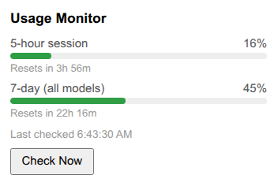
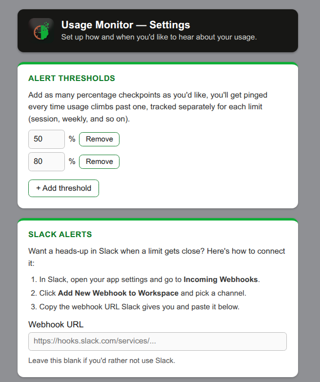
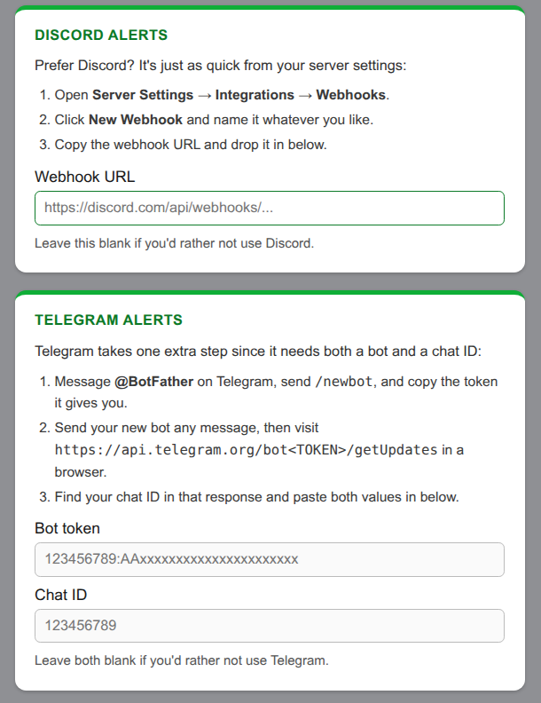
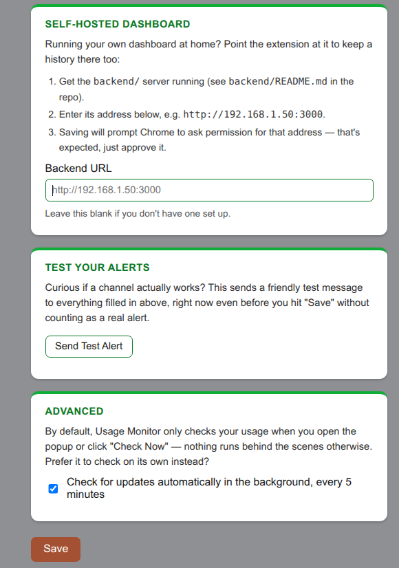
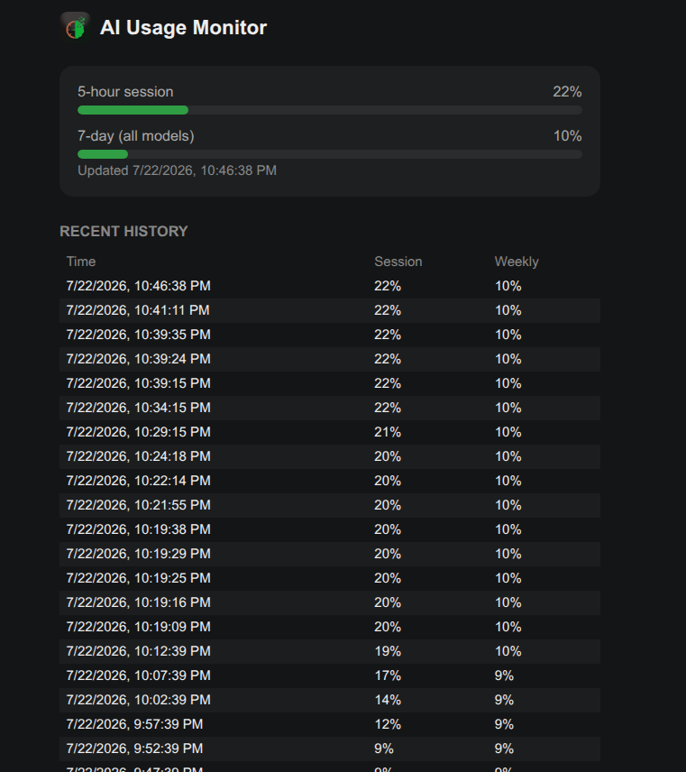

# Usage Monitor

A Chrome extension that checks your Claude.ai usage percentage on demand —
no API key, no separate login, just your existing browser session. Comes
with optional alerts (Discord/Telegram/Slack) and an optional self-hosted
dashboard if you want your usage history on more than one device.

**Not affiliated with, endorsed by, or sponsored by Anthropic.** It's an
independent tool that reads usage info from your own account, the same way
the Claude.ai website itself would show you.

## What it does

- Shows your current 5-hour session and weekly usage as color-coded bars,
  right in the toolbar popup, along with when each one resets ("Resets in
  2h 34m")
- Checks on demand — open the popup or hit "Check Now" — rather than
  polling in the background by default. There's an "Advanced" setting if
  you'd rather it check automatically every 5 minutes instead.
- Optional alerts to Discord, Telegram, and/or Slack when usage crosses a
  threshold you set — and you can set more than one (e.g. 50%, 80%, 95%),
  each tracked independently
- A "Send Test Alert" button so you can confirm a webhook/bot token
  actually works without waiting for real usage to cross anything
- Optional self-hosted dashboard (`backend/`) — you run it on your own
  hardware — for viewing usage history from other devices

## What it doesn't do

- Doesn't read your conversations or prompts, only the account-level usage
  percentage
- Doesn't phone home anywhere — the only network calls it makes are to
  Claude.ai (to read your usage) and to whichever alert channels/backend
  *you* configure yourself
- Doesn't poll in the background unless you explicitly turn that on

## How to use it

**Install (from source):**
1. `npm install && npm run build`
2. `chrome://extensions` → enable Developer mode → Load unpacked → select
   the repo root (the folder with `manifest.json`, not `dist/`)

Not comfortable building from source? See [`INSTALL.md`](INSTALL.md) for a
plainer download-and-load walkthrough — same underlying steps, just without
needing Node.

**Day to day:** click the toolbar icon. It shows whatever was last checked,
then immediately checks again — you'll see a "Checking…" flash and then
fresh numbers. Hit "Check Now" any time you want to re-check without
closing the popup.

**Set up alerts (optional):** open the extension's options page.
- **Alert Thresholds** — add as many percentage checkpoints as you want
- **Slack / Discord / Telegram** — each section walks you through getting a
  webhook URL or bot token for that specific service
- **Test Your Alerts** — fire a test message to everything you've filled in,
  before you even hit Save
- **Advanced** — flip this on if you want it checking in the background
  every 5 minutes instead of only when you open the popup

**Self-hosted dashboard (optional):** see `backend/README.md`. Short version:
`cd backend && docker compose up -d --build`, then point the extension's
Backend URL setting at wherever it's running. If you want to check it from
your phone without exposing it to the whole internet, something like
Tailscale works well for that — that's how mine's set up.

## Privacy & permissions

Full policy is in [`backend/public/privacy.html`](backend/public/privacy.html)
(or wherever you end up hosting the backend). Short version: it reads the
`lastActiveOrg` cookie and your usage percentage from Claude.ai's own
endpoint, using your existing logged-in session — never your password or
session key. Nothing leaves your machine except to Claude.ai itself, or to
alert channels/a backend you deliberately configure.

What each permission is for:
- **storage** — saves your settings and the last snapshot locally
- **alarms** — only scheduled if you turn on Advanced background checking
- **cookies** — reads `lastActiveOrg` on claude.ai, nothing else
- **host_permissions** (claude.ai, discord.com, api.telegram.org,
  hooks.slack.com) — claude.ai to read usage, the others only used if you
  configure that alert channel
- **optional_host_permissions** (`http(s)://*/*`) — Chrome's recommended
  pattern for a user-supplied endpoint; only requested for the specific
  backend address you enter, only if you use the self-hosted dashboard

## Challenges I ran into

- **Claude's usage endpoint isn't documented anywhere** — had to reverse
  engineer the shape of it from DevTools (`src/providers/claude.ts`). It
  could change without warning, which is why that's kept as the one file
  that should need fixing if the badge ever shows `!`.
- **MV3 service workers get killed constantly.** `setInterval` doesn't
  survive that, so background checks have to go through `chrome.alarms`
  instead — which behaves completely differently (fires even after the
  worker's been unloaded and restarted).
- **Getting the default behavior right took a rewrite.** It started as
  always-on background polling every 5 minutes. Turned out that's not
  actually what you want by default — for a Chrome Web Store listing it
  also reads a lot better as "checks on demand" than "polls your account
  continuously in the background." Ended up redesigning it so background
  polling is opt-in (Advanced setting), and the default is a check on popup
  open or "Check Now," message-passed to the background worker so there's
  still just one read/save/badge/alert pipeline instead of two.
- **Multiple alert thresholds needed their own de-dup state.** One
  threshold, one armed/disarmed flag, was easy. Multiple thresholds meant
  each one needed to be armed/disarmed independently — a jump from 40% to
  96% has to fire the 50%, 80%, and 95% alerts all at once, not just the
  first one it crosses.
- **Found a real CSRF-to-XSS chain in the self-hosted backend during a
  security pass.** The dashboard renders snapshot data with `innerHTML`,
  and `POST /snapshots` had no auth (by design, LAN-only) *and* didn't
  check `Content-Type` — meaning a malicious webpage visited from a device
  on the same network could've blind-POSTed a fake snapshot with a
  `<script>` payload as the "label," which would then execute in the
  dashboard next time anyone opened it. Fixed by escaping on render, deep-
  validating the payload shape server-side, and requiring the real
  `Content-Type` (which forces a CORS preflight the server doesn't answer,
  blocking the attack outright).
- **Docker + bind mounts + non-root doesn't just work.** Switching the
  backend's container off root to harden it meant the bind-mounted
  `data/` directory on the host needed its ownership fixed too, or the
  container could build and start fine while silently failing to write
  the database.
- **A "capped" limit wasn't actually capped.** `/snapshots/history?limit=`
  was clamped with `Math.min(1000, ...)` but had no lower bound — SQLite
  treats a *negative* `LIMIT` as "no limit at all," so `?limit=-1` quietly
  returned the entire table instead of erroring or getting capped. Found
  during a pre-launch security pass; fixed by clamping both ends.

## What I learned

Building this pushed me through a few areas I hadn't spent much time in
before: Manifest V3's whole ephemeral-service-worker model (and how much it
changes what "background" even means for an extension), how to reverse
engineer an undocumented API responsibly (read-only, your own data, nothing
more), and — probably the biggest one — that "it's just for me on my LAN"
is not the same thing as "it's safe," since browsers don't actually respect
network boundaries the way I assumed (a "simple request" can cross origins
without permission, no VPN required). Also came away with a much better
feel for how much a default behavior choice matters for how a tool actually
gets perceived and used, not just how it works.

## Roadmap

- Chrome Web Store submission — not yet submitted
- Email to Anthropic about the extension, once this build's been stable for
  a while
- Backend dashboard's history view is a flat list (last 50), no charting
  yet
- A true native home-screen widget (vs. the PWA "Add to Home Screen" it has
  now) — parked, needs native app development that doesn't seem worth it
  yet

## Feedback

Found a bug, or just want to say hi? The options page footer links to my
[GitHub](https://github.com/darkanon6) and
[LinkedIn](https://www.linkedin.com/in/jacob-daniel-rweteshi/).
